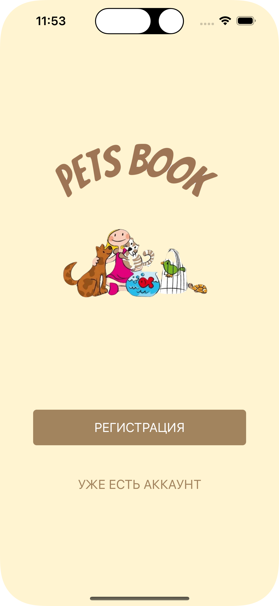
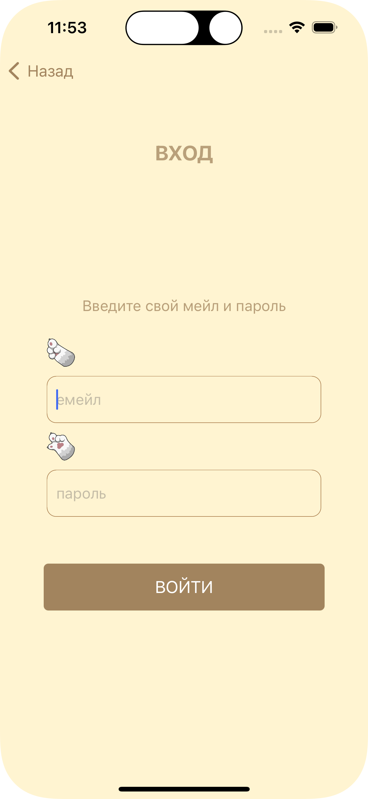
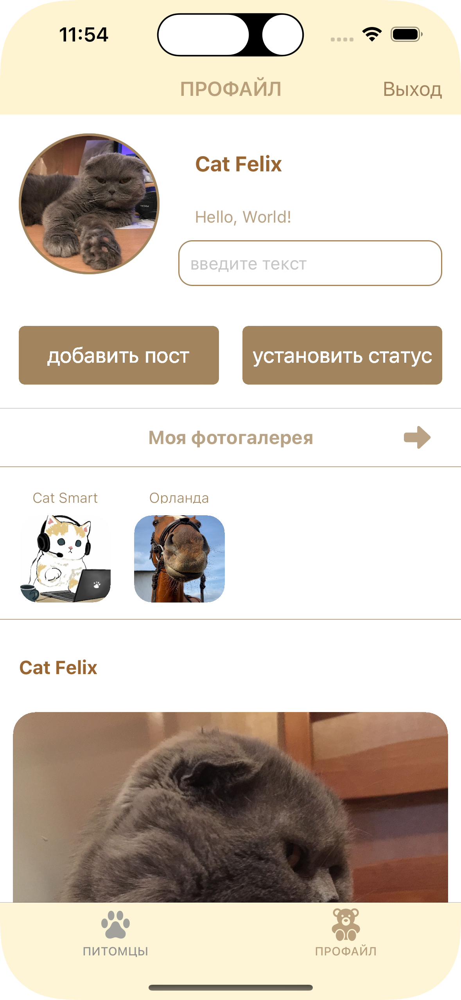
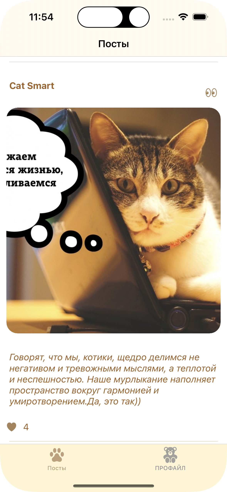

#  Pets Book 🐾

Pets Book - это мини-социальная сеть, созданная для владельцев домашних животных. Пользователи могут создавать индивидуальные профили для своих питомцев, делиться своими впечатлениями и находить новых друзей-любителей животных.

### Особенности:

1. **Создание Профиля:** пользователи могут создавать отдельные профили для своих питомцев, указывая их имена, добавляя аватарки и устанавливая статусы.

2. **Фотогалерея:** пользователи могут загружать фотографии своих питомцев в их галереи, сохраняя свои любимые моменты и приключения

3. **Посты:** пользователи могут создавать посты с фотографиями, чтобы рассказывать о жизни своих питомцев. Эти посты отображаются в ленте постов.

4. **Лента постов:** пользователи могут просматривать посты других пользователей, открывать и просматривать контент.

5. **Система подписок:** пользователи могут ставить лайки к постам и добавлять понравившиеся профили в закладки.

## Локализация:

Pets Book поддерживает локализацию:

- Русский
- Английский

      

## Хранение данных и технологии:

- **Хранение данных** Используется Firebase для хранения данных приложения
- **Технологии** Приложение разработано программно на UIKit

### Как Использовать:

1. **Регистрация/Вход в Аккаунт:**  Начните с регистрации аккаунта или входа, если вы уже пользователь Pets Book.

2. **Создание Профиля:** Создайте профиль для вашего питомца, предоставив его имя, загрузив фотографию профиля и установив статус.

3. **Загрузка Фотографий:** Заполните галерею своего питомца прекрасными фотографиями, загружая их с вашего устройства.

4. **Делитесь Обновлениями:** Пишите посты о приключениях вашего питомца, его достижениях или просто о повседневной жизни, сопровождая их фотографиями.

5. **Исследуйте Ленту:** Открывайте посты от других владельцев питомцев, пролистывая ленту. Лайкайте посты, которые вам понравились.

6. **Связывайтесь с Другими:** Подписывайтесь на других владельцев питомцев, чьи посты вам нравятся.

### Планы на Будущее:

1. **Прямые Сообщения:** Внедрение системы приватных сообщений между пользователями для более персонального взаимодействия и общения.

2. **Настройка Профилей:** Позволить пользователям дополнительно настраивать профили своих питомцев с помощью дополнительной информации и опций настройки.

3. **Улучшенная Фильтрация Ленты:** Внедрение продвинутых опций фильтрации контента в ленте, таких как по типу питомца или местоположению, для настройки контента под предпочтения пользователей.

